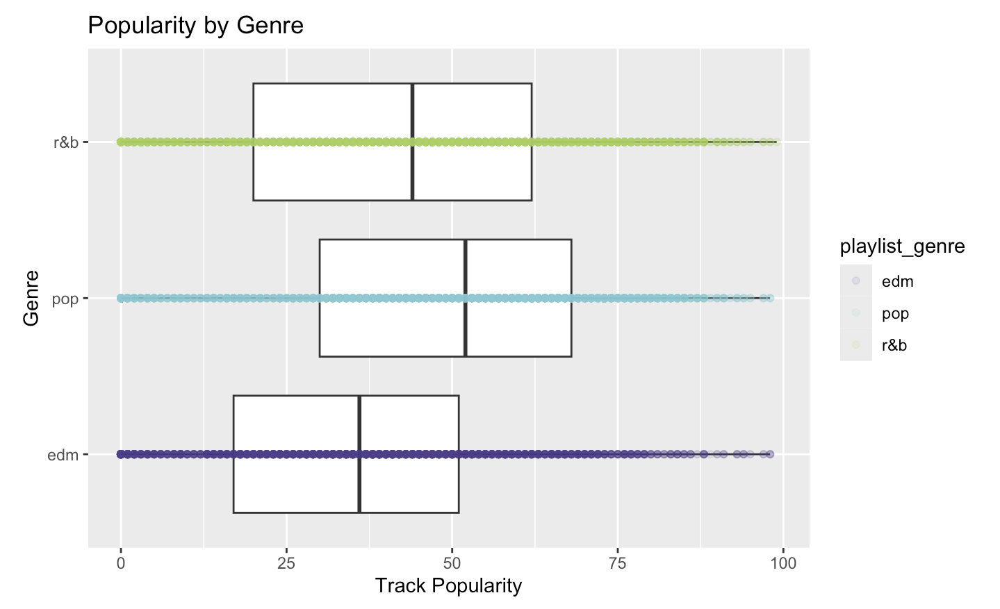

## Summary

### Main Question and Objective

This project investigates what audio characteristics make a Spotify song popular and whether those songs can be meaningfully groups and classifies by genre based on those characteristics terms. Using a subset of the Spotify Song Dataset refined to Pop, R&B, and EDM genres, the three most streamed genres and my personal favorites, the project explores how measurable audio features such as loudness, energy, dancebility, tempo, and acousticness correlates to a song's popularity score and track genre.

### Main Insights

Across the exploratory, unsupervised, and supervised analyses, three consistent findings emerged that together answer the project's central question. Audio features such as energy, danceability, and loudness all showed a modest positive relationship with track popularity that plateaued at extreme values, suggesting that sufficiently high production intensity gives songs a streaming advantage within Pop, R&B, and EDM, but that no single audio feature is a strong standalone predictor of success. These same audio dimensions proved partially useful for predicting genre in supervised classification, with the decision tree achieving approximately 62% cross-validated accuracy well above the 33% random baseline, though Pop remained the hardest genre to classify correctly because it borrows stylistic elements from both EDM and R&B and occupies the most central and overlapping position in audio feature space. Taken together, these findings suggest that while Spotify's audio features capture meaningful structure in music, popularity and genre identity are both complex outcomes that audio characteristics alone can only partially explain.


{width="5.91in" height="3.55in"}

The figure compares track popularity across Pop, EDM, and R&B songs. Pop songs tend to achieve the highest typical popularity, while EDM shows the greatest variability in popularity scores. R&B has a lower median popularity overall despite containing several highly popular songs. These differences suggest that genre may help explain variation in Spotify popularity and motivate further modeling using audio features and genre classification.


## Motivation and Context

Music streaming has fundamentally changed how songs become popular. On platforms like Spotify, which hosts over 100 million tracks and serves more than 600 million users, a song's visibility is shaped not just by marketing or radio play but by algorithmic recommendation systems that match listeners to music based on audio characteristics. Understanding what makes a song popular — and what audio features define genre boundaries — has practical implications for artists, producers, and playlist curators alike. This project uses the Spotify Song Dataset, a publicly available collection of track metadata and audio features extracted through the Spotify Web API, to investigate two related questions: what audio characteristics are associated with higher popularity scores, and whether those same characteristics can be used to classify songs by genre without any prior genre information. By focusing on Pop, R&B, and EDM — three genres that together dominate modern streaming — the analysis explores both the predictive power of Spotify's audio features and the degree to which genre identity is encoded in measurable sound characteristics.

```{r}
#| label: do this first
#| echo: false
#| message: false

here::i_am("math-437-project-template.qmd")
```

## Packages Used In This Analysis

```{r}
#| label: load packages
#| message: false
#| warning: false

library(dplyr)
library(ggplot2)
library(tidyverse)
library(tidymodels)
library(tidyclust)
library(tidyr)
library(GGally)
library(discrim)
library(rpart)
library(mvtnorm)
```

| Package | Use |
|--------------------------------|----------------------------------------|
| [here](https://github.com/jennybc/here_here) | to easily load and save data |
| [readr](https://readr.tidyverse.org/) | to import the CSV file data |
| [dplyr](https://dplyr.tidyverse.org/) | to massage and summarize data |
| [rsample](https://rsample.tidymodels.org/) | to split data into training and test sets |
| [ggplot2](https://ggplot2.tidyverse.org/) | to create nice-looking and informative graphs |
| [tidyverse](https://www.tidyverse.org) | to provide a collection of core data science packages for data import, wrangling, and visualization |
| [tidymodels](https://tidymodels.tidymodels.org) | to provide a unified framework for modeling and machine leanring workflows |
| [tidyclust](https://tidyclust.tidymodels.org/) | to perform clustering within the tidymodels framework |
| [tidyr](https://tidyr.tidyverse.org) | to reshape and tidy data into a consistent format |
| [GGally](https://ggobi.github.io/ggally/) | to create extended visualizations such as pair plots |
| [discrim](https://discrim.tidymodels.org/) | to access classification models like discriminant analysis |
| [rpart](https://cran.r-project.org/package=rpart) | to build recursive partitioning trees for regression and classification |
| [mvtnorm](https://cran.r-project.org/package=mvtnorm) | to compute multivariate normal and t-distribution functions |

## Data Description

The dataset used for this project is the ***Spotify Song Data***, publicly available through the [TidyTuesday GitHub](https://github.com/rfordatascience/tidytuesday/blob/master/data/2020/2020-01-21/readme.md) repository and originally compiled by Charlie Thompson using the spotifyr package and the Spotify Web API. Each observation represents one individual song appearing in a Spotify playlist, with the full dataset containing 32,833 observations and 23 variables. Variables include identifying information such as track name, artist, album, and genre, along with numerical audio features measured by Spotify's internal algorithms. These audio features are defined by Spotify as follows: ***danceability*** measures how suitable a track is for dancing based on tempo, rhythm stability, and beat strength on a scale of 0 to 1; ***energy*** represents the perceived intensity and activity of a track, where higher values correspond to faster, louder, and more dynamic songs; ***valence*** describes the musical positivity of a track, with higher values sounding more happy and euphoric; ***tempo*** measures the estimated beats per minute of the track; ***acousticness*** measures the likelihood that a track was produced without electronic amplification on a scale of 0 to 1; ***speechiness*** detects the presence of spoken words in a track; ***loudness*** measures the overall average volume of a track in decibels, and ***playlist_genre*** that categorizes each song to 1 of 7 genres, or in the case of the subsetted data, 1 of 3 genres. The response variable, ***track_popularity***, is a score from 0 to 100 reflecting total plays and recency of streams, where 100 represents the most popular songs on the platform.

```{r}
#| label: import data
#| warning: false
spotify_songs <- readr::read_csv('https://raw.githubusercontent.com/rfordatascience/tidytuesday/main/data/2020/2020-01-21/spotify_songs.csv')
```

## Data Wrangling

Since the full dataset includes many genres, the data was subset to only include songs from the Pop, R&B, and EDM genres, reducing the dataset down to 16,981 observations. These genres were selected because they are more represented in modern streaming music and provide enough observations for meaningful analysis. These genres are also my personal top genres to listen to on Spotify. This subset allows for easier comparison of song characteristics while reducing noise from less common genres.

After importing, the subsetted dataset was divided into a training set of 70% and a test set of 30% using random sampling. This split is commonly used in statistical learning because it provides enough observations to train accurate models while reserving a substantial portion of unseen data for evaluating predictive performance. The training set is used to build models, while the test set gives an unbiased measure of how well the model generalizes to new songs.

```{r}
#| label: subset spoitify songs by genre
spotify <- spotify_songs[spotify_songs$playlist_genre %in% c("pop", "edm", "r&b"), ]
```

```{r}
#| label: split into training and testing set

set.seed(127, kind = "Mersenne-Twister")
spotify_split <- initial_split(spotify,
                               prop = 0.70
                               )
spotify_train <- training(spotify_split)
spotify_test <- testing(spotify_split)

```

## Exploratory Data Analysis

### Track Popularity

Track popularity is the main response variable in this project making it important to first understand how popularity score are distributed across songs in the training set. By examining the distribution, it helps determine whether most songs are similarly popular or if a small number of songs are scaled on a relatively higher popularity score.

```{r}
#| label: popularity distribution
ggplot(data = spotify_train,
       mapping = aes(x = track_popularity)
       ) + 
  geom_histogram(binwidth = 5,
                 fill = "#2E86AB",
                     color = "black"
                 ) + 
  labs(title = "Distribution of Song Popularity",
       x = "Track Popularity",
       y = "Count")
```

The histogram supports these findings by showing that popularity is spread across the range, with many songs concentrated in the low to middle and middle ranges rather than only at the highest values. There is a large spike of songs with a popularity score of essentially zero, and then a separate roughly bell-shaped distribution centered around moderate popularity values of 40 to 60. There are fewer songs near the maximum popularity levels, suggesting that extremely popular songs are less common than moderately popular ones. This pattern is realistic because only a limited number of songs become major hits, while many others achieve moderate visibility.

To investigate whether this distinction matters for the analysis, popularity was recoded into two groups: songs with a score of zero and songs with a non-zero score.

```{r}
#| label: zero popularity groups

# create a new variable that separates songs into zero popularity and non-zero popularity groups
spotify_train <- spotify_train |>
  mutate(popularity_group = ifelse(track_popularity == 0, # popularity_group = when track_popularity is 0 
                                   "Zero Popularity", 
                                   "Non-Zero Popularity"))

ggplot(data = spotify_train,
       mapping = aes(x = track_popularity,
                     fill = popularity_group)) +
  geom_histogram(binwidth = 5,
                 color = "black",
                 alpha = 0.8) +
  scale_fill_manual(
    values = c("Zero Popularity" = "#E07B54",
               "Non-Zero Popularity" = "#2E86AB")
  ) +
  labs(title = "Distribution of Song Popularity by Group",
       x = "Track Popularity",
       y = "Count",
       fill = "Group")
```

The separation highlights that a meaningful proportion of songs in the training set have zero popularity, which may reflect the temporal nature of Spotify's scoring algorithm rather than anything about the song's audio characteristics. For the remainder of the analysis, this distinction is worth keeping in mind — models predicting popularity may behave differently for zero-popularity songs than for songs with active streaming numbers, and the relationships observed between audio features and popularity may be stronger or cleaner when zero-popularity songs are considered separately.

### Danceability

Danceability is next explored as it is one of Spotify's most recognizable features and may help to explain why some songs are more popular than others. According to Spotify, danceability measures how suitable a track is for dancing based on characteristics such as tempo, rhythm stability, beat strength, and overall regularity. Since the dataset focuses on Pop, Rap, and EDM songs, danceability is especially relevant because these genres often emphasize rhythm and movement.

```{r}
#| label: danceability distribution 
ggplot(data = spotify_train,
       mapping = aes(x = danceability)
       ) + 
  geom_histogram(binwidth = 0.05,
                 fill = "skyblue",
                     color = "black"
                 ) + 
  labs(title = "Distribution of Song Danceability",
       x = "Danceability",
       y = "Count")
```

The histogram showcases these findings by showing that most songs are concentrated between roughly 0.55 and 0.80, with relatively few songs at the very low end of the scale. This pattern is expected because Pop, R&B, and EDM are genres commonly associated with strong beats and energetic production. Songs with extremely low danceability are uncommon in this subset.

### Popularity vs. Danceability

The relationship between track popularity and dancebility is compared to determine whether song with lower danceability tend to perform better on Spotify streaming. Since danceability reflects rhythm strength, beat consistency, and movement potential, it is reasonable to investigate whether more danceable songs attract more listeners and streams, especially within Pop, R&B, and EDM genres.

```{r}
#| label: scatterplot of danceability of popularity
ggplot(data = spotify_train,
       mapping = aes(x = danceability,
                     y = track_popularity)
       ) +
  geom_point(alpha = 0.2,
             color = "skyblue4") +
  geom_smooth(method = "loess",
              se = FALSE) +
  labs(title = "Popularity vs. Danceability",
       x = "Danceability",
       y = "Track Popularity")
```

### Popularity by Genre

Track popularity was compared across genres to determine whether certain genres tend to perform better on Spotify than others. Genre is an important categorical variable because listener preferences, playlist placement, and mainstream exposure often differ across music styles. Comparing popularity distributions across EDM, Pop, and R&B, we can see whether genre may help explain variation in song popularity.

```{r}
#| label: box plot of popularity by genre
ggplot(data = spotify_train,
       mapping = aes(x = playlist_genre,
                     y = track_popularity)
       ) +
  geom_boxplot() + coord_flip() + 
  geom_point(mapping = aes(color = playlist_genre),
             alpha = 0.1
             ) + 
  labs(title = "Popularity by Genre",
       x = "Genre",
       y = "Track Popularity") + 
  scale_color_manual(values = c("edm" = "darkslateblue", 
                                "pop" = "cadetblue3", 
                                "r&b" = "darkolivegreen3")
                                    )
```

The boxplot summarizes the distribution of popularity within each genre. For each category, the center line represents the median popularity, the box shows the middle 50% of songs, and the whiskers indicate the broader spread of typical values. Individual song points were added with transparency to show the raw observations and reveal the density of songs at different popularity levels.

The graph suggests that Pop songs generally have the highest typical popularity, with a higher median and many songs centered in moderate to high popularity ranges. This is consistent with Pop music often receiving broad mainstream exposure through major playlists, radio, and recommendation algorithms. Since Pop is designed for wide audiences, it may have an advantage in attracting streams across many listener groups.

R&B songs appear competitive but may show a somewhat different distribution depending on the exact subset. The median and overall range is the lowest of the three genres despite some R&B songs becoming major hits.

EDM songs often show greater spread, while still slightly lower than Pop, meaning the genre may contain both tracks with modest popularity and breakout hits with strong popularity. This is common in EDM because the genre includes a mix of underground producers, festival centered music, and crossover artists with large audiences.

## Modeling

### Decision Trees

A decision tree is a classification method that predicts an outcome by splitting the data into smaller and smaller groups based on feature values. At each step, the algorithm chooses a variable and a cutoff value that best separates the data into different classes. This process continues until the tree reaches terminal nodes, or leaves, where a final prediction is made. In simple terms, a decision tree works like a flowchart where each split asks a question about the song’s features, eventually leading to a predicted genre.

The hyperparameter in this decision tree model is the cost complexity parameter, which controls how complex the tree is allowed to become. Specifically, cost complexity parameter determines whether additional splits are worth making by penalizing overly complex trees. The choice of cost complexity parameter affects the bias-vairance tradeoff. Smaller values of cost complexity allow the tree to grow deeper and capture more detailed patterns in the data, but this can lead to overfitting, where the model performs well on training data but poorly on new data. Larger values of cost complexity result in a simpler tree by pruning splits, which reduces overfitting but may lead to underfitting if the model becomes too simplistic.

To find a balance, a grid of cost complexity values ranging from very small to larger values was executed using 5-fold cross-validation with 3 repeats. Model performance was assessed using both accuracy and mean log-loss. The results showed that performance improved as cost complexity decreased up to a point, after which it stabilized or worsened. The model’s classification accuracy was approximately 0.56 on average across cross-validation folds, which represents the expected performance on new data. Using the one-standard-error rule applied to the accuracy results, a cost complexity value of 0.00215 was selected, favoring a simpler tree that maintains strong predictive performance while improving generalizability.

```{r}
#| label: classification tree

# define a classification tree model
# cost_complexity is tuned later using cross validation
spotifyC_model <- decision_tree( mode = "classification",
                              engine = "rpart",
                              cost_complexity = tune() 
                              )

# create a recipe using Spotify audio features
spotifyC_recipe <- recipe(playlist_genre ~ danceability + energy + loudness +
                            speechiness + acousticness +
                            instrumentalness + liveness +
                            valence + tempo,
                          data = spotify_train
                          )

# create workflow using the model and recipe 
spotifyC_wflow <- workflow() |>
  add_model(spotifyC_model) |>
  add_recipe(spotifyC_recipe)
```

```{r}
#| label: tune classification tree model

# 5 fold cross validation on the training set
spotify_kfold <- vfold_cv(spotify_train, 
                          v = 5,
                          repeats = 3)

# tune different cost complexity values
# evaluates each model using log loss and accuracy
spotifyC_tune <- tune_grid(spotifyC_wflow,
                        resamples = spotify_kfold,
                        grid = grid_regular(cost_complexity(range = c(-4,0)),
                                             levels = 10
                                            ),
                        metrics = metric_set(mn_log_loss, accuracy)
                        )
```

```{r}
#| label: plot metrics
autoplot(spotifyC_tune)
```

```{r}
#| label: select best tree - mean log loss

# select the simplest classification tree whose
spotifyC_best <- select_by_one_std_err(spotifyC_tune,
                                       metric = "mn_log_loss", # perform mean log loss 
                                       desc(cost_complexity)
                                       )
spotifyC_best 
```

```{r}
spotifyC_tune |>
  show_best(metric = "mn_log_loss")
```

```{r}
#| label: finalize and fit tree

# finalize the workflow using the selected cost complexity tuning parameter
spotifyC_wflow_final <- spotifyC_wflow |>
  finalize_workflow(parameters = spotifyC_best)

# fit on full training set 
spotifyC_fit <- fit(spotifyC_wflow_final,
                    data = spotify_train)
```

```{r}
#| label: fit the finalized classification tree model
spot_kfold <- fit_resamples(
  spotifyC_wflow_final, 
  resamples = spotify_kfold,
  metrics = metric_set(mn_log_loss, accuracy) 
)

spot_kfold |>
  collect_metrics()
```

```{r}
#| label: look at tree
par(xpd = TRUE) # makes it so we can see the tree

spotifyC_fit |>
  extract_fit_engine() |>
  plot()

spotifyC_fit |>
  extract_fit_engine() |>
  text(use.n = TRUE)
```

***Note***: Although this tree may appear dense and difficult to read at the scale shown here, enlarging the figure reveals a structured and interpretable set of decision rules. The most important splits occur at the top of the tree, where energy is the primary splitting variable — songs with high energy are most likely classified as EDM, while songs with lower energy are further split by tempo, acousticness, and speechiness to distinguish between Pop and R&B. This hierarchical structure is consistent with the EDA findings that energy and acousticness are the dominant audio dimensions separating the three genres, and confirms that the decision tree is capturing meaningful patterns in the data rather than fitting noise.

## Conclusion

This project set out to answer whether Spotify's audio features could explain what makes a song popular and whether they could distinguish between genres. The answer to both questions is: partially, but not completely. The Exploratory Data Analysis revealed that energy, danceability, and loudness all have modest positive associations with track popularity, with a consistent pattern of diminishing returns at extreme values. No single feature predicts popularity strongly, confirming that streaming success is a complex, multivariate outcome that audio characteristics alone cannot fully capture. Factors outside the dataset — artist fame, playlist placement, release timing, and social media virality — almost certainly play a larger role than any audio feature. The k-means clustering analysis found that songs naturally organize along an energy-acousticness axis, separating electronic and acoustic production styles into distinct groups that loosely align with genre boundaries. The decision tree classifier confirmed that genre is partially recoverable from audio features, achieving 62% cross-validated accuracy compared to a 33% random baseline, though Pop remained the hardest genre to classify due to its stylistic overlap with both EDM and R&B.

### Limitations and Future Work

Many limitations of this analysis should also be acknowledge. The first and foremost being that this original dataset was collected in 2020, meaning the findings reflect a streaming landscape that has changed considerably since then, genres have evolved, new artists have emerged, and Spotify's recommendation algorithm has been updated multiple times, all of which affect how popularity scores are distributed today. Furthermore, the dataset was subset to only three genres, limiting the generalizability of the findings to Spotify's broader catalog. Within the model, Pop songs were the most poorly predicted class, frequently misclassified as either EDM or R&B. This is because Pop as a genre deliberately absorbs stylistic elements from surrounding genres, creating an acoustically ambiguous profile that sits in the middle of the audio feature space and that no classifier trained on sound alone can reliably distinguish.

Regarding the assumptions behind the analytical methods, the decision tree makes relatively few distributional assumptions compared to parametric models, which is one of its strengths for this dataset, but the independence assumption is potentially violated since songs from the same artist share correlated audio features, meaning the effective sample size may be smaller than the 11,886 training observations suggest.

Looking ahead, future work could address these limitations by collecting a more current dataset directly from the Spotify Web API, incorporating non-audio features such as artist follower count and release date, and exploring more flexible ensemble models like random forests that better capture interactions between correlated audio features. Finally, if models like this were used by platforms or labels to make promotion decisions, they risk creating feedback loops that favor certain production styles and reduce musical diversity — a concern worth considering any time algorithmic tools are applied to culturally embedded creative data.
